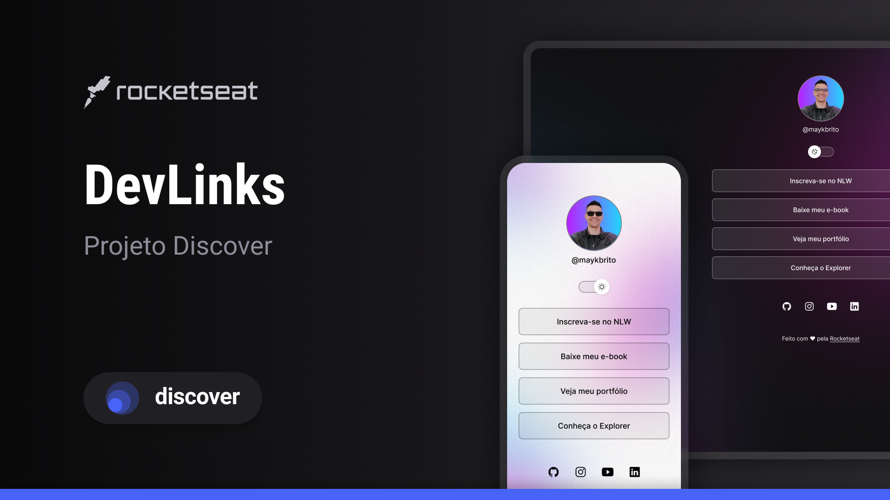

<h1 align="center">DEV LINKS</h1>

Evento exclusivo e gratuito, promovido pela Rocketseat para ensino de tecnologias WEB.

<a href="#-tecnologias">Tecnologias</a>&nbsp;&nbsp;&nbsp;|&nbsp;&nbsp;&nbsp;
<a href="#-projeto">Tecnologias</a>&nbsp;&nbsp;&nbsp;|&nbsp;&nbsp;&nbsp;
<a href="#-layout">Tecnologias</a>&nbsp;&nbsp;&nbsp;|&nbsp;&nbsp;&nbsp;
<a href="#memo-licença">Licença</a>

  

 

  

## Tecnologias

Esse projeto foi desenvolvido com as seguintes tecnologias:

- HTML e CSS
- JavaScript
- Git e Github
- Figma

# Projeto

O DevLinks é um agregador de links para usar como cartão de visitas online.

Você pode visualizar o layout do projeto através [DESSE LINK](<https://www.figma.com/design/Jt1zCBU4e5si2uaJKBlhaj/DevLinks-%E2%80%A2-Projeto-Discover-(Community)?node-id=10-620&t=PKELoTkJTFXW7GJ7-0>). É necessário ter conta no [Figma](https://figma.com) para acessá-lo.

## :memo: Licença

Esse projeto está sob a licença MIT.

Feito com maestria por Belmontes :wave: [Participe da nossa comunidade](https://discord.gg/snackclub)
